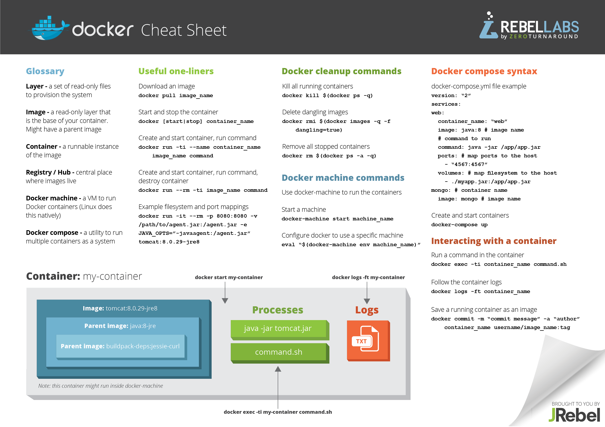

# Docker
[Docker](https://www.docker.com/) is an open-source project that automates the deployment of applications by packaging an application with all of its dependencies into software containers. Docker containers wrap up a piece of software in a complete filesystem that contains everything it needs to run: code, runtime, system tools, system libraries – anything you can install on a server. This guarantees that it will always run the same, regardless of the environment it is running in. The difference between docker containers and typical Virtual Machines (VMs): 

Download Docker engine [here](https://docs.docker.com/engine/installation/) 

# CB-Geo docker images

[CB-Geo](https://hub.docker.com/u/cbgeo/) has custom docker images for different software codes:

* [CB-Geo base docker image](https://hub.docker.com/r/cbgeo/cb-geo/)

* [CB-Geo MPM / FEM docker image](https://hub.docker.com/r/cbgeo/mpm/)

* [CB-Geo CA-ABM docker image](https://hub.docker.com/r/cbgeo/ca-abm/)

# Docker useful commands

### Clone the docker container
* `docker pull cbgeo/cb-geo:latest`. The tag `latest` is not required. Clone the container appropriate for your use case, for eg., use `cbgeo/mpm` for FE / MPM code 

### Using the docker image
* The docker image can be used directly from the Docker Hub
* To launch the `cbgeo/ca-abm`  docker container, run `docker run -ti cbgeo/cb-geo:latest /bin/bash`

### Run the container with local volume mounted
* `docker run -ti -v /home/<user>/<mounted-folder>/ cbgeo/cb-geo:latest`

### Connecting to a running container
* `docker exec -ti <containerid> /bin/bash`

### To login as root
* Launching docker as root user: `docker exec -u 0 -ti <containerid> /bin/bash`

### Creating an image from the docker file

* To build an image from docker file run as root `docker build -t "cbgeo/cb-geo" /path/to/Dockerfile`
* `docker history` will show you the effect of each command has on the overall size of the file.

# Docker cheat sheet

[Docker self-paced training](https://training.docker.com/self-paced-training)

